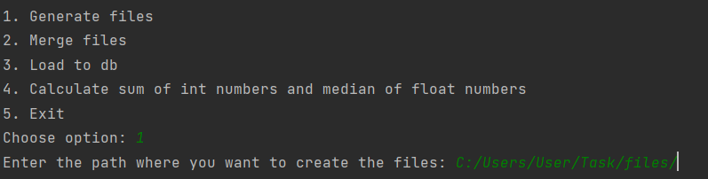
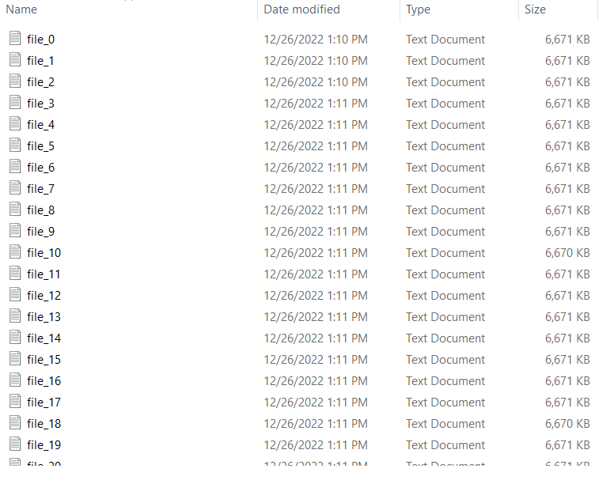
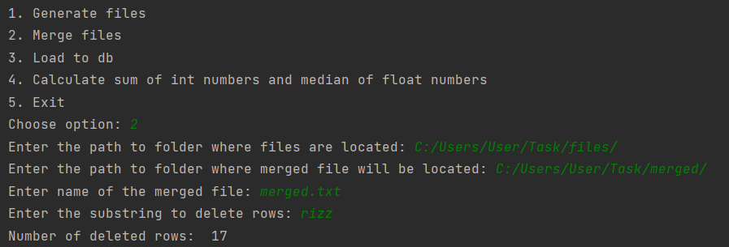
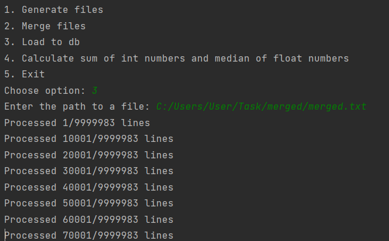
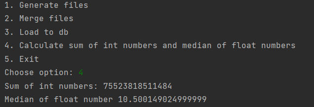

# Тестовое задание

## Example of application run

### File generation:






### File merging:



### Loading to the db:





### SQL query
```postgresql
SELECT SUM(int_number),
       PERCENTILE_CONT(0.5) WITHIN GROUP(ORDER BY float_number)
FROM data;
```

### Result:


