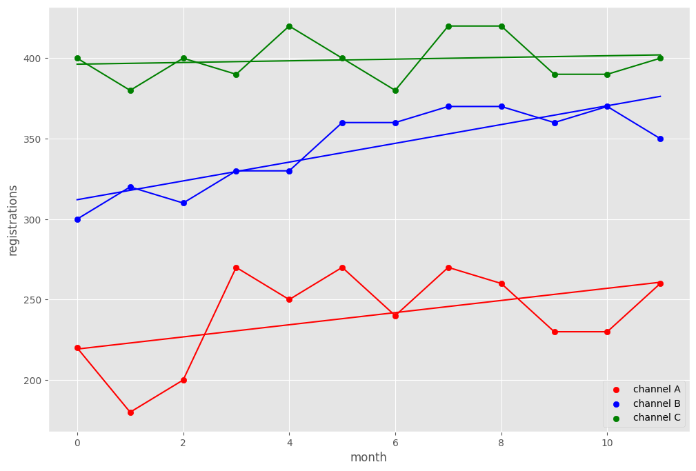
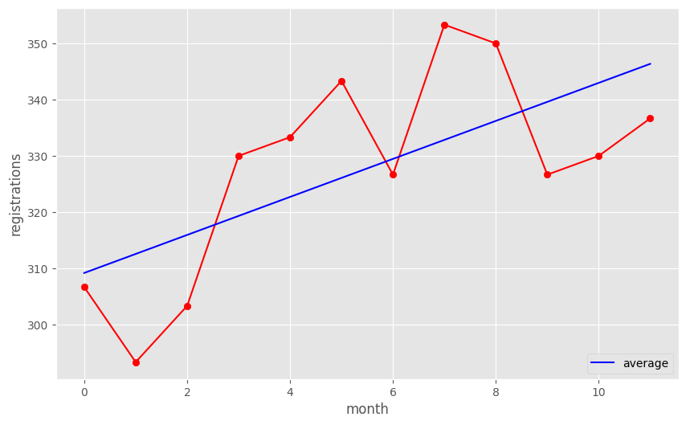

# Прогнозирование эффективности каналов регистрации пользователей.
 

## Загрузка и подготовка данных для анализа
Программный код, который используется в отчете [по ссылке](https://github.com/Grag2015/testWG/blob/master/Task%202%20Minsktrans.Rmd) 

## Анализ данных
Посмотрим на средние показатели предоставленных данных   

| Показатель                        | Канал A | Канал B | Канал С | Канал D | Все каналы |
|-----------------------------------|---------|---------|---------|---------|------------|
| Среднее число регистраций в месяц | 240     | 344     | 399     | 100     | 328        |

Мы видим, что Канал С наиболее результативный, на втором месте канал В, на третьем канал А, канал D, значение по которому предстоит спрогнозировать показал за 3 месяца совсем невысокие показатели.

Далее, посмотрим на показатели регистрации по каналам во временной динамике
 
Видно, что каналы А и В показывают положительную динамику, а  канал С оставался на одном и том же уровне в течение года. Можно заметить, что в целом наблюдается положительный тренд, посмотрим более внимательно на среднюю регистрацию по каналам. 

 
На данном графике следует обратить внимание на положительный тренд, который обозначен синей линией на графике. 

Данный тренд показывает, что за 12 месяцев (с июня по май) число регистраций выросло, что в свою очередь свидетельствует о росте популярности сервиса. 

*Замечание*: Данная линейная аппроксимация построена методом наименьших квадратов.
(детали доступны [по ссылке]())

Для оценки искомого значения предлагаю применить найденный ранее тренд к базовому значению , за базу возьмем среднее арифметическое по каналу D.  Т.к. тренд выражен линейной функцией, то легко найти прогнозируемое за июнь число регистраций - 133.79

**Вывод:** спрогнозированное на июнь количество регистраций равно 133.79

