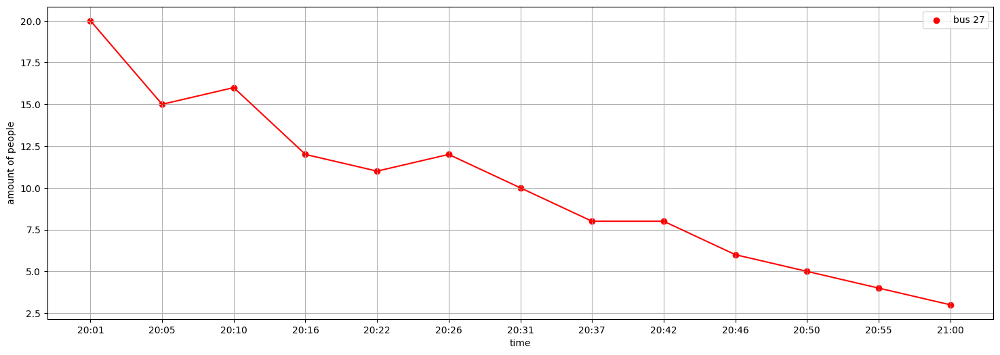
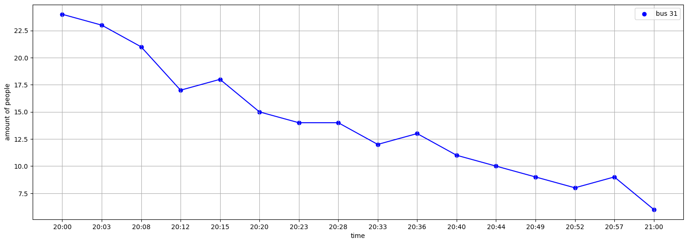
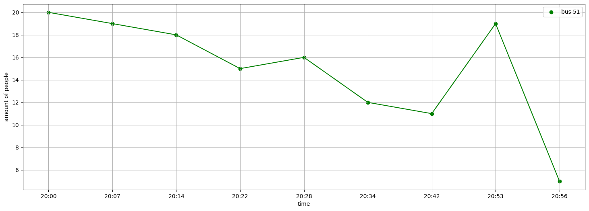
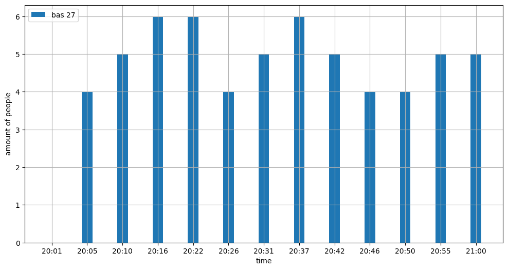
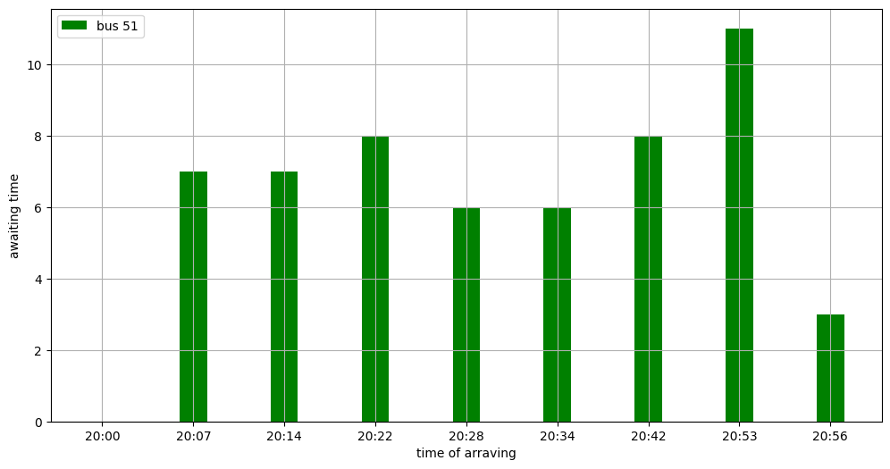
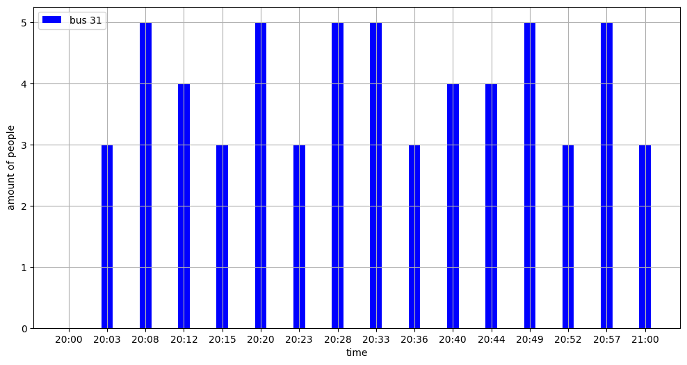

# Анализ жалобы на плохую работу транспорта на станции «Дружная» с 20:00 до 21:00.

## Загрузка и подготовка данных для анализа
Программный код, который используется в отчете [по ссылке]((https://github.com/FyodorBSU/MMF.BSU.PM.FYODORRUTSKY2019-20/blob/master/test_task_priorbank/source/task2(buses).ipynb)

## Общие характеристики работы транспорта на диспетчерской станции «Дружная» в интервале времени с 20:00 до 21:00.
Исходя из  предоставленных данных были расчитаны основные характеристики работы троллейбусов на станции “Дружная” с 20:00 до 21:00

Посмотрим на средние показатели предоставленных данных   

| Показатель                       | Все маршруты | 51  | 31  | 27   |
|----------------------------------|--------------|-----|-----|------|
| Средний интервал движения(мин)   | 5            | 7   | 4   | 4.92 | 
| Максимальный интервал(мин)       | 11           | 11  | 5   | 6    | 
| Количество пассажиров(среднее)   | 13           | 15  | 14  | 10   | 
| Количество пассажиров(суммарное) | 489          | 135 | 224 | 130  | 

Видно, что наибольший поток пассажиров на маршруте 31 составляет 224 пассажира в час, при этом средний интервал движения на маршруте ниже среднего показателя по станции, а средняя загрузка троллейбуса составляет 14 человек, что также выше среднего. Можно сказать, что по данным показателям маршрут 31 показывает уровень выше среднего.
Маршрут 27 по среднему интервалу на  уровне среднего показателя по станции, но ниже среднего по загрузке.
Маршрут 51 же имеет максимальный средний интервал движения и максимальную загрузку.(Здесь можно предположить, что скорее всего большой интервал движения маршрута 51 и является причиной жалобы.)

Посмотрим на поток пассажиров в динамике по времени

 
 

На представленных выше графиках вижно, что поток пассажиров сильно падает. При это на маршруте 51, это падение не такое сильное и однозначное.

Посмотрим на хронологию прибытия и интервалы движения

 
 

На маршруте 51 в райне 20:55 виден значительный всплеск ожидающих пассажиров, сопоставив с интервалами движения в течение часа на гистограммах представленных выше можно заметить, что этот пик приходится на ту же максимульную задержку в 11 минут, которую была обнаружена ранее. 

**Вывод:** Исходя из всего вышеперечисленного, причиной жалобы стало отклонение от среднего интервала в районе 20:55 маршрута 51(люди ждали 11 минут вместо привычных 7), из-за чего на остановке собралось почти 20 человек (вместо обычных для второй половины часа 10 человек).

